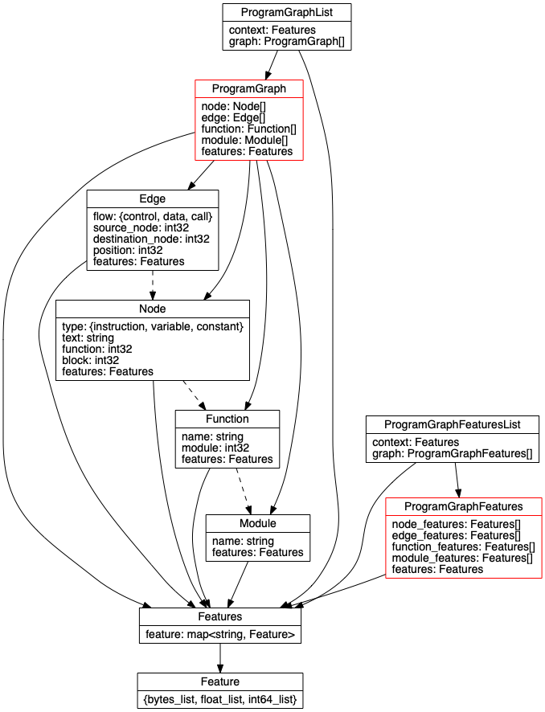

# Protocol Buffers

Protocol buffers are used for the storing structured data in this project.

## Program Graphs

Program graphs are represented using a `ProgramGraph` message. This diagram
shows the relationship between the various message types which make up program
graphs:

Where solid lines indicate composition, and dashed lines show inferred
relationships (e.g an index into a list of objects of the pointed-to type).
