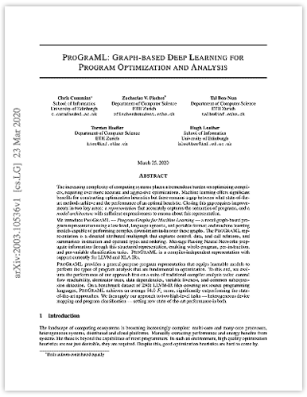

# ProGraML: Graph-based Deep Learning for Program Optimization and Analysis
[Chris Cummins](https://chriscummins.cc/).
[Zach Fisches](https://github.com/Zacharias030).
[Tal Ben-Nun](https://people.inf.ethz.ch/tbennun/).
[Torsten Hoefler](https://htor.inf.ethz.ch/).
[Hugh Leather](http://homepages.inf.ed.ac.uk/hleather/).

<a href="https://arxiv.org/abs/2003.10536">
  
</a>

**Abstract:**
> The increasing complexity of computing systems places a tremendous
> burden on optimizing compilers, requiring ever more accurate and
> aggressive optimizations. Machine learning offers significant
> benefits for constructing optimization heuristics but there remains
> a gap between what state-of-the-art methods achieve and the
> performance of an optimal heuristic. Closing this gap requires
> improvements in two key areas: a representation that accurately
> captures the semantics of programs, and a model architecture with
> sufficient expressiveness to reason about this representation.
>
> We introduce ProGraML - Program Graphs for Machine Learning - a
> novel graph-based program representation using a low level, language
> agnostic, and portable format; and machine learning models capable
> of performing complex downstream tasks over these graphs. The
> ProGraML representation is a directed attributed multigraph that
> captures control, data, and call relations, and summarizes
> instruction and operand types and ordering. Message Passing Neural
> Networks propagate information through this structured
> representation, enabling whole-program or per-vertex classification
> tasks.
>
> ProGraML provides a general-purpose program representation that
> equips learnable models to perform the types of program analysis
> that are fundamental to optimization. To this end, we evaluate the
> performance of our approach first on a suite of traditional compiler
> analysis tasks: control flow reachability, dominator trees, data
> dependencies, variable liveness, and common subexpression
> detection. On a benchmark dataset of 250k LLVM-IR files covering six
> source programming languages, ProGraML achieves an average 94.0 F1
> score, significantly outperforming the state-of-the-art
> approaches. We then apply our approach to two high-level tasks -
> heterogeneous device mapping and program classification - setting
> new state-of-the-art performance in both.


```
@article{cummins2020a,
  title={ProGraML: Graph-based Deep Learning for Program Optimization and Analysis},
  author={Cummins, Chris and Fisches, Zacharias and Ben-Nun, Tal and Hoefler, Torsten and Leather, Hugh},
  journal={arXiv:2003.10536v1},
  year={2020}
}
```
