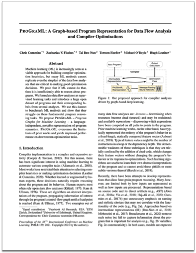
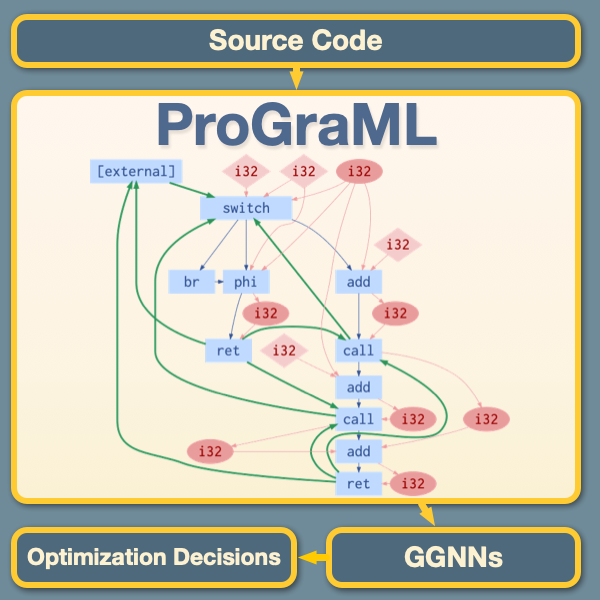

# ProGraML: A Graph-based Program Representation for Data Flow Analysis and Compiler Optimizations
[Chris Cummins](https://chriscummins.cc/),
[Zach Fisches](https://github.com/Zacharias030),
[Tal Ben-Nun](https://people.inf.ethz.ch/tbennun/),
[Torsten Hoefler](https://htor.inf.ethz.ch/),
[Michael O'Boyle](http://www.dcs.ed.ac.uk/home/mob/),
[Hugh Leather](http://homepages.inf.ed.ac.uk/hleather/).

**tl;dr:** For ML to be able to reason about programs it must be able to reason
about graphs.

<a href="https://github.com/ChrisCummins/ProGraML/raw/febeb692d49d90fe7125d12ace5a0298a9458523/Documentation/icml-2021/paper.pdf">
  
</a>


**Abstract:**
> Machine learning (ML) is increasingly seen as a viable approach for building
> compiler optimization heuristics, but many ML methods cannot replicate even
> the simplest of the data flow analyses that are critical to making good
> optimization decisions. We posit that if ML cannot do that, then it is
> insufficiently able to reason about programs. We formulate data flow analyses
> as supervised learning tasks and introduce a large open dataset of programs
> and their corresponding labels from several analyses. We use this dataset to
> benchmark ML methods and show that they struggle on these fundamental program
> reasoning tasks. We propose ProGraML - *Program Graphs for Machine Learning* -
> a language-independent, portable representation of program semantics. ProGraML
> overcomes the limitations of prior works and yields improved performance on
> downstream optimization tasks.



```
@inproceedings{cummins2021a,
  title={{ProGraML: A Graph-based Program Representation for Data Flow Analysis and Compiler Optimizations}},
  author={Cummins, Chris and Fisches, Zacharias and Ben-Nun, Tal and Hoefler, Torsten and O'Boyle, Michael and Leather, Hugh},
  booktitle = {Thirty-eighth International Conference on Machine Learning (ICML)},
  year={2021}
}
```
